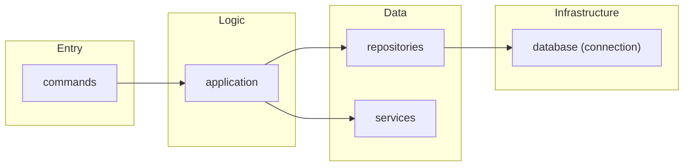
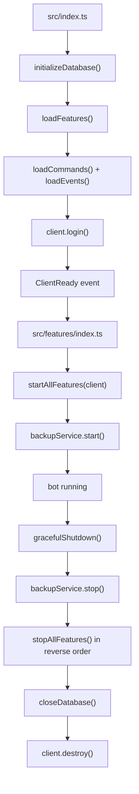

# Project Structure

The project uses feature-based architecture. Each feature owns its command entrypoints, background services, and feature-specific repository layer under `src/features/`.

## Structure

```text
src/
├── index.ts                 # App bootstrap and graceful shutdown
├── client.ts                # Discord client configuration
├── config/
│   ├── env.ts               # Environment variables
│   ├── constants.ts         # Internal constants (AUDIO, MONITORING, BOT_INFO)
│   └── index.ts
├── features/
│   ├── index.ts             # Feature auto-discovery, startAllFeatures/stopAllFeatures
│   ├── helpCatalog.ts       # Shared help catalog types
│   ├── __tests__/           # Feature registry tests
│   ├── steam/
│   │   ├── index.ts         # Feature lifecycle (name, start, stop)
│   │   ├── commands/        # Slash command definitions (auto-loaded)
│   │   ├── application/     # Command/business logic handlers
│   │   ├── repositories/    # Database access with real SQL queries
│   │   ├── services/        # Steam API, notifications, scheduler
│   │   ├── lib/             # Steam-only helpers/constants
│   │   ├── __tests__/       # Colocated tests
│   │   └── helpCatalog.ts
│   ├── voice/
│   │   ├── index.ts
│   │   ├── commands/
│   │   ├── application/
│   │   ├── events/
│   │   ├── services/
│   │   ├── __tests__/
│   │   └── helpCatalog.ts
│   ├── poll/
│   │   ├── index.ts
│   │   ├── commands/
│   │   ├── application/
│   │   ├── events/
│   │   ├── services/
│   │   ├── __tests__/
│   │   └── helpCatalog.ts
│   ├── admin/
│   │   ├── index.ts
│   │   ├── commands/
│   │   ├── application/
│   │   ├── repositories/    # Settings, audit, DB stats (real SQL)
│   │   ├── __tests__/
│   │   └── helpCatalog.ts
│   ├── general/
│   │   ├── index.ts
│   │   ├── commands/
│   │   ├── application/
│   │   └── helpCatalog.ts
│   ├── github/
│   │   ├── index.ts
│   │   ├── commands/
│   │   ├── application/
│   │   ├── events/
│   │   ├── services/
│   │   └── helpCatalog.ts
│   ├── notification/
│   │   ├── index.ts
│   │   ├── commands/
│   │   ├── application/
│   │   ├── events/
│   │   ├── repositories/
│   │   ├── services/
│   │   ├── __tests__/
│   │   └── helpCatalog.ts
│   └── community/
│       ├── index.ts
│       ├── commands/
│       ├── application/
│       └── helpCatalog.ts
├── events/                  # Core client/interaction events
├── handlers/                # Auto-loaders for commands and events
├── middleware/
│   ├── index.ts             # Middleware pipeline (runMiddleware)
│   ├── permissions.ts
│   ├── cooldown/            # Cooldown middleware + store
│   │   ├── cooldownMiddleware.ts
│   │   ├── cooldownStore.ts
│   │   ├── index.ts
│   │   └── __tests__/
│   └── __tests__/           # Middleware tests
├── services/
│   ├── database/
│   │   ├── connection.ts    # DB connection, pragma, close ONLY
│   │   ├── transaction.ts   # runTransaction
│   │   ├── index.ts         # Barrel re-export
│   │   └── migrations/      # DDL definitions
│   │       ├── index.ts     # initializeDatabase()
│   │       ├── 001_steam.ts
│   │       ├── 002_notifications.ts
│   │       ├── 003_settings.ts
│   │       └── 004_notification.ts
│   ├── audit/               # Audit logging + channel notifications
│   │   ├── index.ts
│   │   ├── format.ts
│   │   └── __tests__/
│   ├── backup/              # Scheduled DB backups
│   │   ├── index.ts
│   │   ├── storage/
│   │   └── __tests__/
│   ├── health/              # Health check service
│   │   ├── index.ts
│   │   └── __tests__/
│   └── metrics/             # In-memory metrics
│       ├── index.ts
│       └── __tests__/
├── utils/                   # Cross-feature pure utilities
├── locales/                 # i18n (en, ja)
├── types/                   # Shared type definitions
└── scripts/                 # Maintenance scripts
```

## Feature Rules

- Every feature must export `name`, `start(client)`, and `stop()` from its `index.ts`.
- Features are **auto-discovered**; no manual registration is needed. `loadFeatures()` scans feature directories and builds the registry.
- `startAllFeatures(client)` and `stopAllFeatures()` handle per-feature **error isolation** and **health status**. A failing feature does not block others.
- `start(client)` is invoked only after the Discord `ready` event, so feature startup may rely on `client.isReady()` and warmed guild caches.
- `commands/` must contain only public slash command definition files that are auto-loaded by `src/handlers/commandHandler.ts`.
- Internal command logic should live in `application/`.
- Feature-specific persistence access should live in that feature's `repositories/`. Repositories contain **actual SQL queries**, not thin wrappers.
- `src/services/` is reserved for truly shared infrastructure, not feature-owned business logic.

## Layer Architecture

Request flow from slash command to persistence:



- **commands**: Slash command definitions; delegate to application layer.
- **application**: Command/business logic handlers; orchestrate repositories and services.
- **repositories**: Database access with real SQL; use `runTransaction()` for multi-table writes.
- **services**: Feature-owned services (Steam API, notifications, etc.) or shared infrastructure.
- **database**: Pure infrastructure—connection, pragma, transactions, migrations only.

## Database Layer

- `services/database/` is **pure infrastructure**: connection management, `runTransaction()`, and migrations.
- No business logic or feature-specific queries live here. All SQL lives in feature `repositories/`.
- Migrations are numbered DDL files (`001_steam.ts`, `002_notifications.ts`, `003_settings.ts`, `004_notification.ts`) applied by `initializeDatabase()`.

## Middleware

- Cooldown logic moved from `services/cooldown/` to `middleware/cooldown/` (cooldownMiddleware + cooldownStore).
- `runMiddleware()` in `middleware/index.ts` runs the pipeline (permissions, cooldown, etc.) before command execution.

## Tests

- Tests are **colocated** with features: each feature has its own `__tests__/` directory.
- Shared test helpers live in `src/__tests__/helpers/`.
- Middleware tests under `middleware/__tests__/` and `middleware/cooldown/__tests__/`.
- Service tests under `services/<service>/__tests__/`.

## Lifecycle

Startup and shutdown flow:



## Scripts

- `src/scripts/`: TypeScript scripts that operate on the application or Discord state.
- `scripts/` at the repository root: shell scripts for repo workflow such as validation and git hooks.

[← Back to README](../README.md)
