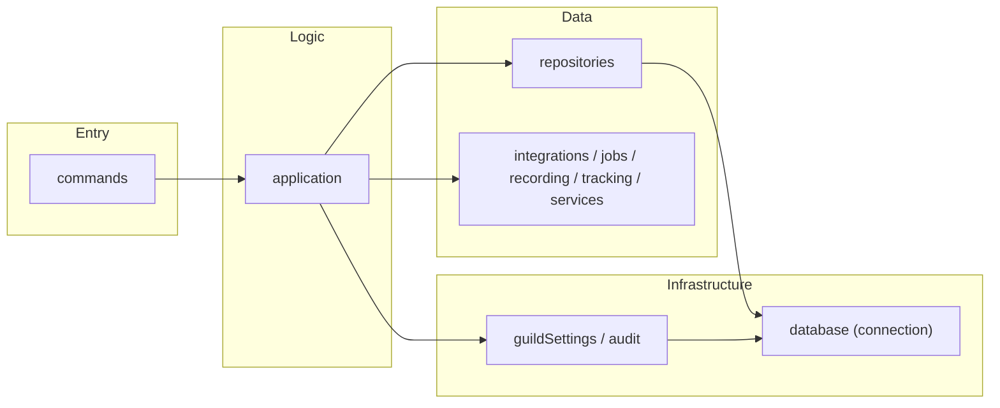
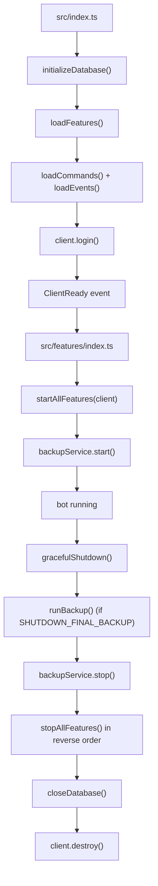

# Project Structure

The project uses feature-based architecture. Each feature owns its command entrypoints, supporting runtime code, and feature-specific repository layer under `src/features/`.

## Structure

```text
.
├── scripts/                 # Repo workflow shell scripts
└── src/
    ├── index.ts             # App bootstrap and graceful shutdown
    ├── client.ts            # Discord client configuration
    ├── app/
    │   └── interactions/
    │       ├── commandRegistry.ts   # Feature command discovery + deployment payload
    │       └── interactionRouter.ts # Chat input / autocomplete / button routing
    ├── app-scripts/         # TypeScript maintenance scripts
    ├── config/
    │   ├── env.ts           # Environment variables
    │   ├── constants.ts     # Internal constants (AUDIO, MONITORING, BOT_INFO)
    │   └── index.ts
    ├── features/
    │   ├── index.ts         # Feature auto-discovery, startAllFeatures/stopAllFeatures
    │   ├── __tests__/       # Feature registry tests
    │   ├── voice/
    │   │   ├── index.ts     # Feature lifecycle (name, start, stop)
    │   │   ├── commands/
    │   │   ├── application/
    │   │   ├── events/
    │   │   ├── recording/
    │   │   ├── repositories/ # Auto-join settings and channel exclusions
    │   │   ├── jobs/
    │   │   ├── __tests__/
    │   │   └── helpCatalog.ts
    │   ├── admin/
    │   │   ├── index.ts
    │   │   ├── commands/
    │   │   ├── application/
    │   │   ├── repositories/ # Settings, audit, DB stats (real SQL)
    │   │   ├── __tests__/
    │   │   └── helpCatalog.ts
    │   ├── general/
    │   │   ├── index.ts
    │   │   ├── commands/
    │   │   ├── application/
    │   │   └── helpCatalog.ts
    │   ├── notification/
    │   │   ├── index.ts
    │   │   ├── commands/
    │   │   ├── application/
    │   │   ├── events/
    │   │   ├── repositories/
    │   │   ├── tracking/
    │   │   ├── __tests__/
    │   │   └── helpCatalog.ts
    │   └── community/
    │       ├── index.ts
    │       ├── commands/
    │       ├── application/
    │       ├── poll/        # Internal poll runtime owned by community
    │       ├── __tests__/
    │       └── helpCatalog.ts
    ├── shared/
    │   ├── help/
    │   │   ├── catalog.ts   # Shared help catalog types/state
    │   │   └── __tests__/   # Catalog vs. command definition consistency
    │   ├── types/           # Cross-feature type definitions
    │   └── utils/           # Cross-feature pure utilities
    ├── events/              # Core client/interaction events
    ├── handlers/            # Auto-loaders for commands and events
    ├── middleware/
    │   ├── index.ts         # Middleware pipeline (runMiddleware)
    │   ├── permissions.ts
    │   ├── cooldown/        # Cooldown middleware + store
    │   │   ├── cooldownMiddleware.ts
    │   │   ├── cooldownStore.ts
    │   │   ├── index.ts
    │   │   └── __tests__/
    │   └── __tests__/       # Middleware tests
    ├── infrastructure/
    │   ├── database/
    │   │   ├── connection.ts  # DB connection, pragma, close ONLY
    │   │   ├── transaction.ts # runTransaction
    │   │   ├── index.ts       # Barrel re-export
    │   │   └── migrations/    # DDL definitions
    │   │       ├── index.ts   # initializeDatabase()
    │   │       ├── 001_steam.ts        # Legacy Steam tables (kept for upgrade path; tables are dropped by 005)
    │   │       ├── 002_notifications.ts # Legacy Steam notification tables (dropped by 005)
    │   │       ├── 003_settings.ts
    │   │       ├── 004_notification.ts
    │   │       ├── 005_drop_steam.ts   # Drops legacy Steam tables on existing DBs
    │   │       ├── 006_polls.ts
    │   │       └── 007_voice_autojoin.ts
    │   ├── guildSettings/   # Sole owner of guild_settings (language, audit/announcement channel, voice auto-join)
    │   │   ├── index.ts
    │   │   └── __tests__/
    │   ├── audit/           # Audit log storage and delivery
    │   │   ├── index.ts
    │   │   ├── auditRepository.ts  # Owns audit_logs
    │   │   ├── format.ts
    │   │   └── __tests__/
    │   ├── backup/          # Scheduled DB backups
    │   │   ├── index.ts
    │   │   ├── storage/
    │   │   └── __tests__/
    │   ├── health/          # Health check service
    │   │   ├── index.ts
    │   │   └── __tests__/
    │   └── metrics/         # In-memory metrics
    │       ├── index.ts
    │       └── __tests__/
    └── locales/             # i18n (en, ja)
```

## Feature Rules

- Every feature must export `name`, `start(client)`, and `stop()` from its `index.ts`.
- Features are **auto-discovered**; no manual registration is needed. `loadFeatures()` scans feature directories and builds the registry.
- `startAllFeatures(client)` and `stopAllFeatures()` handle per-feature **error isolation** and **health status**. A failing feature does not block others.
- `start(client)` is invoked only after the Discord `ready` event, so feature startup may rely on `client.isReady()` and warmed guild caches.
- `commands/` must contain only public slash command definition files that are auto-loaded by `src/handlers/commandHandler.ts`.
- Internal command logic should live in `application/`.
- Feature-specific persistence access should live in that feature's `repositories/`. Repositories contain **actual SQL queries**, not thin wrappers.
- Prefer explicit supporting folder names such as `integrations/`, `jobs/`, `recording/`, `tracking/`, and feature-owned internal modules like `community/poll/`.
- `commands/` files delegate to `application/`; they must not import `repositories/` or `infrastructure/` directly.
- Features never import each other. Anything two features need belongs in `infrastructure/` or `shared/`.
- Features may expose `handleComponent(interaction)` to claim button and select-menu interactions. The router walks the registry, so component UI needs no change outside the feature.
- `src/infrastructure/` is reserved for truly shared runtime infrastructure, not feature-owned business logic. State that several features read - such as `guild_settings` - is owned here, not by whichever feature happens to provide its UI.
- `src/shared/` contains cross-feature utilities, types, and shared registries such as the help catalog.
- These rules are enforced by `src/__tests__/architecture.test.ts`, not just documented.

## Layer Architecture

Request flow from slash command to persistence:



- **commands**: Slash command definitions; delegate to application layer.
- **application**: Command/business logic handlers; orchestrate repositories and supporting runtime folders.
- **repositories**: Database access with real SQL; use `runTransaction()` for multi-table writes.
- **supporting runtime folders**: Feature-owned integrations, background jobs, trackers, recorders, or stateful helpers. Prefer explicit names over a generic `services/` directory, and reserve `services/` for cases like `poll` where a smaller stateful boundary is clearer than further splitting.
- **shared infrastructure**: Cross-feature state and services with their own tables — `guildSettings` (`guild_settings`) and `audit` (`audit_logs`). Features use them; they never depend on a feature.
- **database**: Pure infrastructure under `src/infrastructure/database/`—connection, pragma, transactions, migrations only.

## Database Layer

- `infrastructure/database/` is **pure infrastructure**: connection management, `runTransaction()`, and migrations.
- No business logic or feature-specific queries live here. All SQL lives in feature `repositories/`.
- Migrations are numbered DDL files (`001_steam.ts` … `007_voice_autojoin.ts`) applied by `initializeDatabase()`. They re-run on every boot, so a migration that adds a column checks `PRAGMA table_info` first. The Steam feature has been removed; migrations 001 and 002 are kept untouched for a clean upgrade path, and `005_drop_steam.ts` drops the legacy Steam tables on existing databases.

## Interactions

- Slash commands and events are auto-discovered from `features/*/commands/` and `features/*/events/`.
- Component interactions (buttons, select menus) go through `dispatchComponent()` in `src/features/index.ts`: each feature's optional `handleComponent` is offered the interaction until one returns `true`, with per-feature error isolation.
- Interactive panels use `runComponentPanel()` from `src/shared/utils/panel.ts`, which owns the reply/collect/re-render/expire lifecycle. A panel supplies `render`, `renderDisabled`, and `onComponent`.

## Middleware

- Cooldown logic lives in `middleware/cooldown/` (cooldownMiddleware + cooldownStore).
- `runMiddleware()` in `middleware/index.ts` runs the pipeline (permissions, cooldown, etc.) before command execution.

## Tests

- Tests are **colocated** with features: each feature has its own `__tests__/` directory.
- Shared test helpers live in `src/__tests__/helpers/`.
- Shared utility tests may live under `src/shared/**/__tests__/`.
- Middleware tests under `middleware/__tests__/` and `middleware/cooldown/__tests__/`.
- Infrastructure tests under `infrastructure/<service>/__tests__/`.

## Lifecycle

Startup and shutdown flow:



## Scripts

- `src/app-scripts/`: TypeScript scripts that operate on the application or Discord state.
- `scripts/` at the repository root: shell scripts for repo workflow such as validation and git hooks.

[← Back to README](../README.md)
