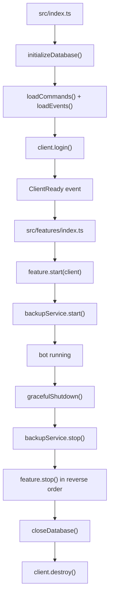

# Project Structure

The project uses feature-based architecture. Each feature owns its command entrypoints, background services, and feature-specific repository layer under `src/features/`.

## Structure

```text
src/
├── index.ts                 # App bootstrap and graceful shutdown
├── client.ts                # Discord client configuration
├── config/                  # Env loading and internal constants
├── features/
│   ├── index.ts             # Feature module registry
│   ├── helpCatalog.ts       # Shared help catalog types
│   ├── steam/
│   │   ├── index.ts         # Feature lifecycle
│   │   ├── commands/        # Public slash command definitions only
│   │   ├── application/     # Command/application layer used by commands
│   │   ├── repositories/    # Steam-specific persistence access
│   │   ├── services/        # Steam API, notifications, scheduler
│   │   ├── lib/             # Steam-only helpers/constants
│   │   └── helpCatalog.ts
│   ├── voice/
│   │   ├── index.ts
│   │   ├── commands/
│   │   ├── events/
│   │   ├── services/
│   │   └── helpCatalog.ts
│   ├── poll/
│   │   ├── index.ts
│   │   ├── commands/
│   │   ├── events/
│   │   ├── services/
│   │   └── helpCatalog.ts
│   ├── admin/
│   │   ├── index.ts
│   │   ├── commands/
│   │   ├── repositories/
│   │   └── helpCatalog.ts
│   ├── general/
│   │   ├── index.ts
│   │   ├── commands/
│   │   └── helpCatalog.ts
│   └── community/
│       ├── index.ts
│       ├── commands/
│       └── helpCatalog.ts
├── events/                  # Core client/interaction events
├── handlers/                # Loaders for commands and events
├── middleware/              # Cross-feature middleware
├── services/                # Shared infrastructure only
│   ├── database/            # DB connection, initialization, shared primitives
│   ├── cooldown/
│   ├── audit/
│   ├── backup/
│   ├── health/
│   └── metrics/
├── scripts/                 # App maintenance scripts (TypeScript)
├── __tests__/               # Tests; prefer source-tree-aligned placement
├── utils/                   # Cross-feature pure utilities
├── locales/                 # i18n resources
└── types/                   # Cross-feature shared types
```

## Feature Rules

- Every feature must export `name`, `start(client)`, and `stop()` from its `index.ts`.
- `start(client)` is invoked only after the Discord `ready` event, so feature startup may rely on `client.isReady()` and warmed guild caches.
- `src/features/index.ts` is the single registry used by `src/index.ts` for startup and shutdown.
- `commands/` must contain only public slash command definition files that are auto-loaded by `src/handlers/commandHandler.ts`.
- Internal command logic should live outside `commands/`, for example in `application/`.
- Feature-specific persistence access should live in that feature's `repositories/`.
- `src/services/` is reserved for truly shared infrastructure, not feature-owned business logic.

## Lifecycle

Startup and shutdown flow:



## Scripts

- `src/scripts/`: TypeScript scripts that operate on the application or Discord state.
- `scripts/` at the repository root: shell scripts for repo workflow such as validation and git hooks.

## Tests

- Prefer placing feature-specific tests under `src/__tests__/features/<feature>/...`.
- Keep only genuinely shared infrastructure tests under `src/__tests__/services/...` or `src/__tests__/utils/...`.
- Integration tests stay under `src/__tests__/integration/...`.

[← Back to README](../README.md)
