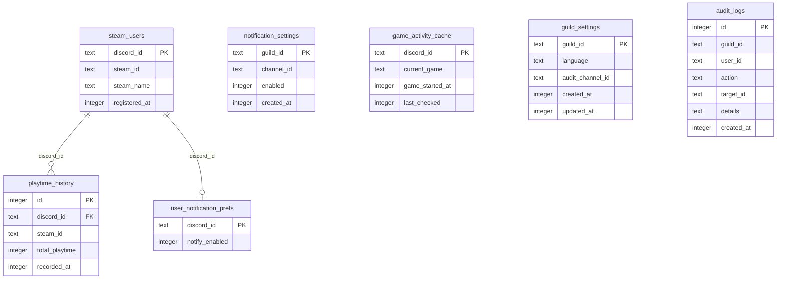

# Database

## Overview

The bot uses **SQLite** via [`better-sqlite3`](https://github.com/JoshuaWise/better-sqlite3) for data persistence.

- **Journal mode**: WAL (Write-Ahead Logging) for better concurrent read/write performance
- **Path**: Configurable via `DATABASE_PATH` env var; defaults to `data/bot.db` (relative to `process.cwd()`)
- **Location**: On Railway, the database lives under `/app/data` when `DATABASE_PATH` is `data/bot.db` and the project root is `/app`

Feature code should prefer feature-local repositories under `src/features/<feature>/repositories/` instead of importing shared database modules directly. `src/services/database/` is reserved for DB bootstrap and shared primitives.

---

## Architecture

```
src/services/database/
├── connection.ts    # Singleton DB connection, WAL mode, path resolution
├── transaction.ts  # runTransaction(fn) — synchronous transaction wrapper
├── migrations/
│   ├── index.ts    # Runs all migrations in order at startup
│   ├── 001_steam.ts
│   ├── 002_notifications.ts
│   └── 003_settings.ts
└── index.ts        # Public exports
```

- **connection.ts**: Creates the SQLite connection, ensures the data directory exists, and sets `journal_mode = WAL`. Exports `database` and `closeDatabase()`.
- **transaction.ts**: Provides `runTransaction(fn)` to run a synchronous function inside a transaction. Commits on success, rolls back on error. Note: better-sqlite3 transactions do not support async functions.
- **migrations/**: Each migration file exports an `up()` function. Migrations run in order at startup via `initializeDatabase()`.

---

## Schema

### steam_users

Discord–Steam account links.

| Column        | Type    | Constraints |
| ------------- | ------- | ----------- |
| discord_id    | TEXT    | PRIMARY KEY |
| steam_id      | TEXT    | NOT NULL    |
| steam_name    | TEXT    |             |
| registered_at | INTEGER | NOT NULL    |

---

### playtime_history

Historical playtime records per user.

| Column         | Type    | Constraints                |
| -------------- | ------- | -------------------------- |
| id             | INTEGER | PRIMARY KEY AUTOINCREMENT  |
| discord_id     | TEXT    | NOT NULL, FK → steam_users |
| steam_id       | TEXT    | NOT NULL                   |
| total_playtime | INTEGER | NOT NULL                   |
| recorded_at    | INTEGER | NOT NULL                   |

**Indices:**

- `idx_playtime_history_discord_id` ON `discord_id`
- `idx_playtime_history_recorded_at` ON `recorded_at`

---

### notification_settings

Per-guild notification configuration.

| Column     | Type    | Constraints        |
| ---------- | ------- | ------------------ |
| guild_id   | TEXT    | PRIMARY KEY        |
| channel_id | TEXT    | NOT NULL           |
| enabled    | INTEGER | NOT NULL DEFAULT 1 |
| created_at | INTEGER | NOT NULL           |

---

### user_notification_prefs

Per-user notification preferences.

| Column         | Type    | Constraints                   |
| -------------- | ------- | ----------------------------- |
| discord_id     | TEXT    | PRIMARY KEY, FK → steam_users |
| notify_enabled | INTEGER | NOT NULL DEFAULT 1            |

---

### game_activity_cache

Cached game activity for notification logic.

| Column          | Type    | Constraints |
| --------------- | ------- | ----------- |
| discord_id      | TEXT    | PRIMARY KEY |
| current_game    | TEXT    |             |
| game_started_at | INTEGER |             |
| last_checked    | INTEGER | NOT NULL    |

---

### guild_settings

Per-guild settings (language, audit channel, etc.).

| Column           | Type    | Constraints  |
| ---------------- | ------- | ------------ |
| guild_id         | TEXT    | PRIMARY KEY  |
| language         | TEXT    | DEFAULT 'ja' |
| audit_channel_id | TEXT    |              |
| created_at       | INTEGER | NOT NULL     |
| updated_at       | INTEGER | NOT NULL     |

---

### audit_logs

Audit log entries for admin actions.

| Column     | Type    | Constraints               |
| ---------- | ------- | ------------------------- |
| id         | INTEGER | PRIMARY KEY AUTOINCREMENT |
| guild_id   | TEXT    | NOT NULL                  |
| user_id    | TEXT    | NOT NULL                  |
| action     | TEXT    | NOT NULL                  |
| target_id  | TEXT    |                           |
| details    | TEXT    |                           |
| created_at | INTEGER | NOT NULL                  |

**Indices:**

- `idx_audit_logs_guild_id` ON `guild_id`
- `idx_audit_logs_created_at` ON `created_at`

---

## AuditAction Types

The `action` column in `audit_logs` stores one of these values:

| Value              | Description                   |
| ------------------ | ----------------------------- |
| `STEAM_REGISTER`   | Steam account linked          |
| `STEAM_UNREGISTER` | Steam account unlinked        |
| `NOTIFY_SETUP`     | Notification setup            |
| `NOTIFY_ENABLE`    | Notifications enabled         |
| `NOTIFY_DISABLE`   | Notifications disabled        |
| `NOTIFY_REMOVE`    | Notification settings removed |
| `SETTINGS_CHANGE`  | Guild settings changed        |
| `AUDIT_SETUP`      | Audit log channel configured  |

Defined in `src/features/admin/repositories/auditRepository.ts` and re-exported from `src/services/audit/index.ts`.

---

## Repository Ownership

| Tables                                                              | Feature | Repositories                                      |
| ------------------------------------------------------------------- | ------- | ------------------------------------------------- |
| steam_users, playtime_history                                       | steam   | `steamUserRepository.ts`, `playtimeRepository.ts` |
| notification_settings, user_notification_prefs, game_activity_cache | steam   | `notificationRepository.ts`                       |
| guild_settings, audit_logs                                          | admin   | `settingsRepository.ts`, `auditRepository.ts`     |

All repositories live under `src/features/<feature>/repositories/`.

---

## Migration System

Migrations live in `src/services/database/migrations/` and are run in order at startup:

1. `001_steam.ts` — steam_users, playtime_history
2. `002_notifications.ts` — notification_settings, user_notification_prefs, game_activity_cache
3. `003_settings.ts` — guild_settings, audit_logs

`initializeDatabase()` runs all migrations inside a single transaction. It is safe to call multiple times; migrations use `CREATE TABLE IF NOT EXISTS` and `CREATE INDEX IF NOT EXISTS`. Initialization is performed once per process.

---

## ER Diagram



---

## Persistence on Railway

When deploying to Railway, add a **Volume** with Mount Path `/app/data` to prevent data loss on redeployments. This directory may contain:

- The SQLite database
- Backups
- Voice recordings
- Disk buffers

Ensure `DATABASE_PATH` points to a path under `/app/data` (e.g. `data/bot.db` when the project root is `/app`). See [Deployment](deployment.md) for details.

[← Back to README](../README.md)
