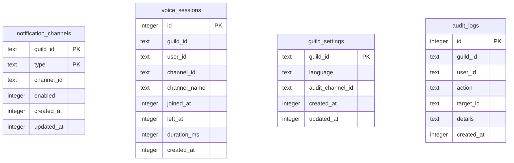

# Database

## Overview

The bot uses **SQLite** via [`better-sqlite3`](https://github.com/JoshuaWise/better-sqlite3) for data persistence.

- **Journal mode**: WAL (Write-Ahead Logging) for better concurrent read/write performance
- **Path**: Configurable via `DATABASE_PATH` env var; defaults to `data/bot.db` (relative to `process.cwd()`)
- **Location**: On Railway, the database lives under `/app/data` when `DATABASE_PATH` is `data/bot.db` and the project root is `/app`

Feature code should prefer feature-local repositories under `src/features/<feature>/repositories/` instead of importing shared database modules directly. `src/infrastructure/database/` is reserved for DB bootstrap and shared primitives.

---

## Architecture

```
src/infrastructure/database/
├── connection.ts    # Singleton DB connection, WAL mode, path resolution
├── transaction.ts  # runTransaction(fn) — synchronous transaction wrapper
├── migrations/
│   ├── index.ts             # Runs all migrations in order at startup
│   ├── 001_steam.ts         # Legacy Steam tables (kept for upgrade/export path)
│   ├── 002_notifications.ts # Legacy Steam notification tables
│   ├── 003_settings.ts
│   ├── 004_notification.ts
│   └── 005_drop_steam.ts    # Non-destructive marker for Steam feature removal
└── index.ts        # Public exports
```

- **connection.ts**: Creates the SQLite connection, ensures the data directory exists, and sets `journal_mode = WAL`. Exports `database` and `closeDatabase()`.
- **transaction.ts**: Provides `runTransaction(fn)` to run a synchronous function inside a transaction. Commits on success, rolls back on error. Note: better-sqlite3 transactions do not support async functions.
- **migrations/**: Each migration file exports an `up()` function. Migrations run in order at startup via `initializeDatabase()`.

---

## Schema

### notification_channels

Per-guild notification channels by type.

| Column     | Type    | Constraints        |
| ---------- | ------- | ------------------ |
| guild_id   | TEXT    | NOT NULL           |
| type       | TEXT    | NOT NULL           |
| channel_id | TEXT    | NOT NULL           |
| enabled    | INTEGER | NOT NULL DEFAULT 1 |
| created_at | INTEGER | NOT NULL           |
| updated_at | INTEGER | NOT NULL           |

**Primary key:**

- `(guild_id, type)`

---

### voice_sessions

Per-user VC session history for statistics.

| Column       | Type    | Constraints               |
| ------------ | ------- | ------------------------- |
| id           | INTEGER | PRIMARY KEY AUTOINCREMENT |
| guild_id     | TEXT    | NOT NULL                  |
| user_id      | TEXT    | NOT NULL                  |
| channel_id   | TEXT    | NOT NULL                  |
| channel_name | TEXT    | NOT NULL                  |
| joined_at    | INTEGER | NOT NULL                  |
| left_at      | INTEGER |                           |
| duration_ms  | INTEGER |                           |
| created_at   | INTEGER | NOT NULL                  |

**Indices:**

- `idx_voice_sessions_guild_user` ON `guild_id, user_id`
- `idx_voice_sessions_guild_channel` ON `guild_id, channel_id`
- `idx_voice_sessions_joined_at` ON `joined_at`

---

### guild_settings

Per-guild settings (language, audit channel, etc.).

| Column           | Type    | Constraints  |
| ---------------- | ------- | ------------ |
| guild_id         | TEXT    | PRIMARY KEY  |
| language         | TEXT    | DEFAULT 'ja' |
| audit_channel_id | TEXT    |              |
| created_at       | INTEGER | NOT NULL     |
| updated_at       | INTEGER | NOT NULL     |

---

### audit_logs

Audit log entries for admin actions.

| Column     | Type    | Constraints               |
| ---------- | ------- | ------------------------- |
| id         | INTEGER | PRIMARY KEY AUTOINCREMENT |
| guild_id   | TEXT    | NOT NULL                  |
| user_id    | TEXT    | NOT NULL                  |
| action     | TEXT    | NOT NULL                  |
| target_id  | TEXT    |                           |
| details    | TEXT    |                           |
| created_at | INTEGER | NOT NULL                  |

**Indices:**

- `idx_audit_logs_guild_id` ON `guild_id`
- `idx_audit_logs_created_at` ON `created_at`

---

## AuditAction Types

The `action` column in `audit_logs` stores one of these values:

| Value             | Description                   |
| ----------------- | ----------------------------- |
| `NOTIFY_SETUP`    | Notification setup            |
| `NOTIFY_ENABLE`   | Notifications enabled         |
| `NOTIFY_DISABLE`  | Notifications disabled        |
| `NOTIFY_REMOVE`   | Notification settings removed |
| `SETTINGS_CHANGE` | Guild settings changed        |
| `AUDIT_SETUP`     | Audit log channel configured  |

Defined in `src/features/admin/repositories/auditRepository.ts`.

---

## Repository Ownership

| Tables                                | Feature      | Repositories                                                    |
| ------------------------------------- | ------------ | --------------------------------------------------------------- |
| notification_channels, voice_sessions | notification | `notificationChannelRepository.ts`, `voiceSessionRepository.ts` |
| guild_settings, audit_logs            | admin        | `settingsRepository.ts`, `auditRepository.ts`                   |

All repositories live under `src/features/<feature>/repositories/`.

---

## Migration System

Migrations live in `src/infrastructure/database/migrations/` and are run in order at startup:

1. `001_steam.ts` — Legacy: steam_users, playtime_history (kept for upgrade/export path)
2. `002_notifications.ts` — Legacy: notification_settings, user_notification_prefs, game_activity_cache
3. `003_settings.ts` — guild_settings, audit_logs
4. `004_notification.ts` — notification_channels, voice_sessions
5. `005_drop_steam.ts` — Non-destructive marker for Steam feature removal; legacy tables are preserved so operators can export or roll back

`initializeDatabase()` runs all migrations inside a single transaction. It is safe to call multiple times; migrations use idempotent DDL such as `CREATE TABLE IF NOT EXISTS` and `CREATE INDEX IF NOT EXISTS`. Initialization is performed once per process.

### Rollback Policy

Migrations do not define `down()` functions. To roll back schema changes:

1. Create a new migration that reverses the change (e.g. `DROP TABLE` or `DROP COLUMN`).
2. Or restore from a backup taken before the migration.
3. For development, deleting the database file and re-running the bot will re-apply all migrations from scratch.

---

## ER Diagram



---

## Retention Policy

Runtime retention is configured with environment variables and enforced by feature cleanup jobs.

- `RECORDING_RETENTION_HOURS` (default: `24`): deletes `.wav` recording files from `data/recordings/`
- `VOICE_SESSION_RETENTION_DAYS` (default: `30`): deletes completed `voice_sessions` rows older than the cutoff
- `AUDIT_LOG_RETENTION_DAYS` (default: `90`): deletes old `audit_logs` rows
- `BACKUP_RETENTION_DAYS` (default: `7`): deletes old backup files

Active or incomplete voice sessions are not deleted by retention cleanup; they are first closed on startup if they were left open by a previous run.

---

## Persistence on Railway

When deploying to Railway, add a **Volume** with Mount Path `/app/data` to prevent data loss on redeployments. This directory may contain:

- The SQLite database
- Backups
- Voice recordings
- Disk buffers

Ensure `DATABASE_PATH` points to a path under `/app/data` (e.g. `data/bot.db` when the project root is `/app`). See [Deployment](deployment.md) for details.

[← Back to README](../README.md)
